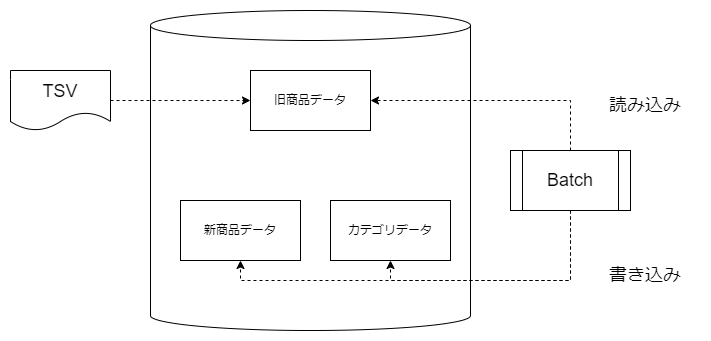

# 商品データ移行プロジェクト

## 概要
- 商品データ移行プロジェクト
  - 商品分類のデータ保持方法を変更するため、140 万件の商品データを移行
  - データを正規化して複数テーブルに分割
  - テキストで保存されている商品のカテゴリを階層化
  - Sppring Batch を使用して移行バッチを作成

## 詳細
- Spring Batch のキャッチアップ
- 移行処理フローの設計
- 移行元・移行先のテーブルを用意
- TSV ファイルを DB のテーブルにロード
- 移行元テーブルから商品カテゴリを個別に抽出して移行
- 移行元テーブルから商品データを移行
- データの整合性をチェックし、移行できないデータをファイルに書き出し
- データ移行実施

 <!-- ![マークダウンサンプル] -->
 <!-- HTMLでの記法でサイズ、位置などが変更できる-->

  

 

### Spring Batch のキャッチアップ
[旧商品データ]テーブルから[新商品データ]テーブル、[カテゴリーデータ]テーブルにデータを移行するため、Spring Batch を使用して移行バッチを作成する。Spring Batch は、大規模なデータ処理を行うためのフレームワークであり、バッチ処理を行うための機能を提供しているため、それを利用する

### 移行処理フローの設計
移行処理フローを設計する。移行処理フローは以下の通りである。
1. 移行元テーブルから商品カテゴリを個別に抽出して移行
2. 移行元テーブルから商品データを移行